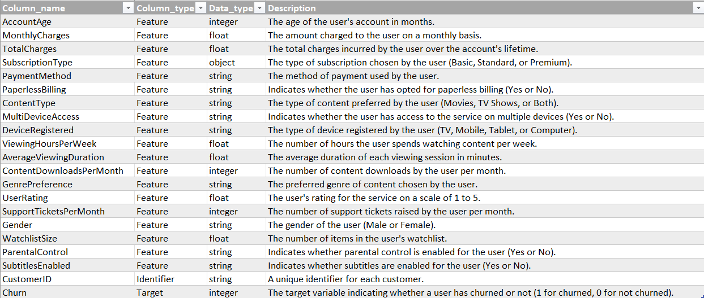
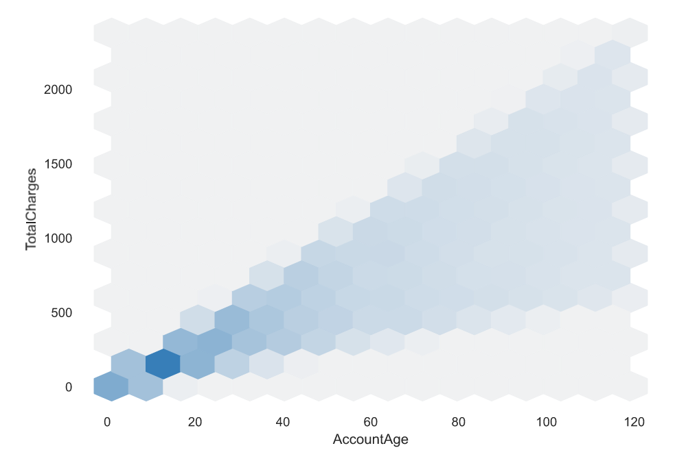
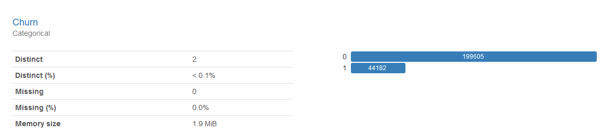

This project was a competition put on by Coursera. It was a quick competition with only three days open for submissions. I achieved a result in the top 1% of all competitors.
## Challenge Description
The goal of this challenge was to predict the probability of customer churn for a streaming service. The performance metric for this challenge was the Area Under the Curve (AUC) of the Receiver-Operating Characteristic (ROC). I suppose you could call this a binary classification problem as a customer will either churn or not, but in reality we are looking to predict the probability that a specific customer will churn, making it arguably a regression. A train and test dataset were provided, with the training dataset containing labels for customer churn. The data description is shown in the table below.

## General Approach
My general approach to data science competitions or small and well-defined projects is:
1. Exploratory Data Analysis (EDA)
2. Data Preparation
3. Cross Validation Strategy
4. Baseline Model Performance
5. Model Selection
6. Feature Engineering
7. Model Tuning

Larger and more complext projects result in a more complex flowchart with time spent gathering and documenting requirements, defining the verification and validaiton strategy, and project management. 

## Exploratory Data Analysis

I like to use ydata profiling, a Python package that can generate a pretty nice html report with one line of code. The report gives a nice summary of each feature that includes some great information such as:

* Number of missing values
* Number of unique values
* Number of zeroes
* Max, min, and mean
* Histogram
* Extreme values
* Correlation matrix
* Variable interactions

The dataset for this competition was relatively straightforward. There were no missing values in either the training or test dataset. There are 10 categorical features, 9 numeric features, a Customer ID, and a binary target (the target present only in the training dataset). There were no significant outliers, unusual distributions, or heavily skewed features. 

Two features were significantly correlated. This turned out to be pretty intuitive, the Account Age correlating highly with Total Charges. 

The above plot comes from ydata profiling and is part of an interactive dashboard that allows you to visualize feature interactions. Pretty nice! You can see a positive linear relationship between these two variables. It may or may not make sense to remove one of these correlated features - we can find out later during feature engineering and model optimization. 

One last note from the analysis - take a look at the distribution of the label, Churn:

Of the training dataset only about 18% of the customers churn. This is an imbalanced dataset. In an ideal world we would have just as many samples where the customer churns as not - a ratio of 50% - so that we could train our models to classify more accurately. There are far worse imbalances in the world - think of a rare disease that affects 1/100,000 patients - but we do not have an equal number of classes in our sample. 

## Data Preparation

My plan was to evaluate baseline performance using four different models: Deep Neural Network (DNN), XGBoost, LightGBM, and Logistic Regression. These are tools that I have used for other competitions with straightforward tabular datasets. A neural network is based on a number of nodes. Each node takes input values, either from the original feature set or from other nodes, and applies a mathematical operation to generate an output. By tuning the coefficients of these mathematical operations one can define complex interactions between features. XGBoost and LightGBM are both boosted, tree-based models. These two models work in slightly different ways and one may offer a performance benefit for a given problem. Logistic regression uses a linear combination of all the features to predict the probability of a classification. I am discussing these models here because each model has different needs for data preparation. 

### Categorical Features

While LightGBM and XGBoost have experimental support for categorical features, my preference is to take responsibility for encoding. Both Logistic Regression and the DNN require some kind of encoding for categorical features so it is something I will be doing anyway. 

For the categorical features in this dataset I chose the one-hot encoding technique. There were some features that you could argue are ordinal (such as Subscription Type - standard, basic and premium), but since one of my models is Logistic Regression there is some danger to ordinal encoding. If I encoded Subscription Type using ordinal encoding and assigned a value of 1 for Basic, 2 for Standard, and 3 for Premium then by nature the contribution of this feature will be stuck with those ratios. Whatever effect Subscription Type contributes through Logistic Regression will be twice for Standard and three times for Premium. By one-hot encoding the model is free to independently determine the contributions of each Subscription Type to the classification.

I like to use Pandas DataFrames to hold and manipulate datasets. The Pandas library is really fantastic and contains many helpful methods for data manipulation and even visualization. Unfortunately for one-hot encoding I feel the standard Pandas technique has a serious shortfall. The Pandas libarary has a get_dummies method that one-hot encodes a column. It can retain the original column name as a prefix and append the categorical value to the column name. This would result in columns like "SubscriptionType_Basic" and "SubscriptionType_Standard." The shortfall is that this method is not persistent. This means that the get_dummies method on your training DataFrame can return a different number of columns than on your test DataFrame if any of the categorical values are not present in one of the two datasets. The sklearn library has a very nice one-hot encoder but unfortunately does not preserve DataFrame column names by default. While it's not terribly hard to work around all of this, I found a [nice class](https://github.com/gdiepen/PythonScripts/blob/master/dataframe_onehotencoder.py) provided by Guido Diepen under the MIT license (thank you, Guido!) that overcomes this issue. You can create an encoder object that you can use to fit and transform your training DataFrame and then transform your test DataFrame. No column mismatch and you get nice and clear column names by default.

All categorical columns were one-hot encoded using the referenced encoder above. The original columns were dropped from the DataFrames.

### Numeric Features

For this challenge, preparation of the numeric features depends on the models used to perform the classification. Two of the models I chose to use in this challenge, XGBoost and LightGBM, are decision tree-based models. As part of the algorithm the model can choose to make a split decision based on a threshold value for a numeric feature. The threshold value is adjusted to minimize entropy. Because of this nature of the algorithm, decision tree-based models do not usually benefit from normalization.

Both the DNN and Logistic Regression models use the product of coefficients and features to predict the classification. If one feature ranges from -10,000 to +50,000 the coefficient will be dramatically different than a feature that ranges from 0.0001 to 0.0003. To help the model converge faster and avoid potential local minima in the loss function, we normalize the numeric features so that they have a consistent range, typically 0 to 1 or -1 to 1. 

I used the MinMaxScaler from the sklearn toolkit and normalized all numeric columns to a range from 0 to 1. 

## Cross Validation Strategy

Have you ever made a change to your model and found a great improvement after testing only to find your leaderboard score actually gets worse? This is a big issue in a lot of competitions and is usually the result of overfitting. If you really want to be able to judge whether a change to your model leads to a true, generalizable improvement, getting a good cross-validation strategy is the key.

The simplest validation strategy is to set aside some percentage of your dataset for testing. This method can work well, but in some cases data critical to training your model to classify properly might be split off into the test dataset. This is especially true in imbalanced datasets. Remember up in our EDA we saw that only 18% of our customers churn? If we set aside 20% of our dataset there is a small chance that all of our examples of churn could be set aside for validation and our model would have no chance of learning how to predict churn. 
