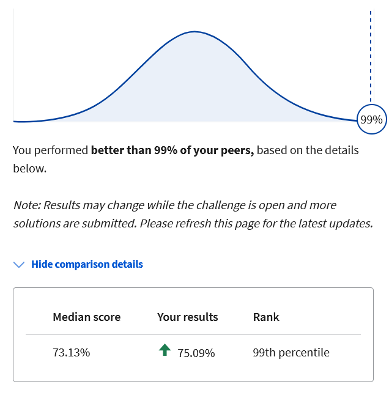
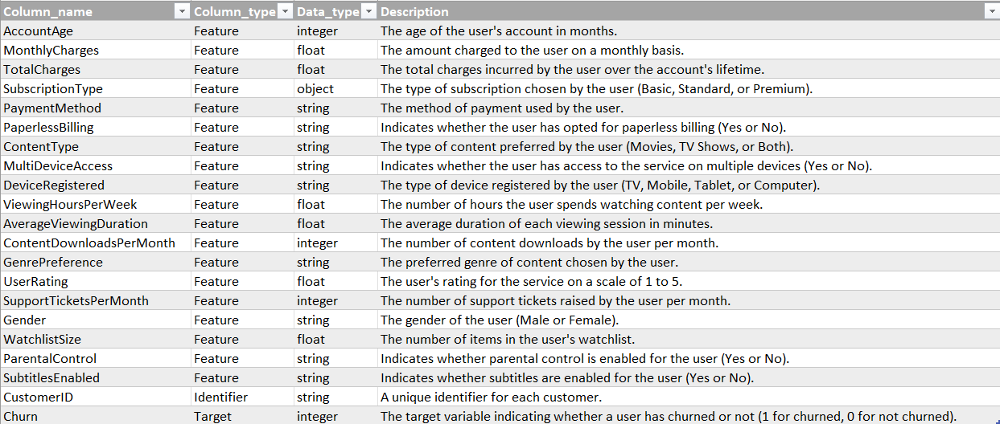
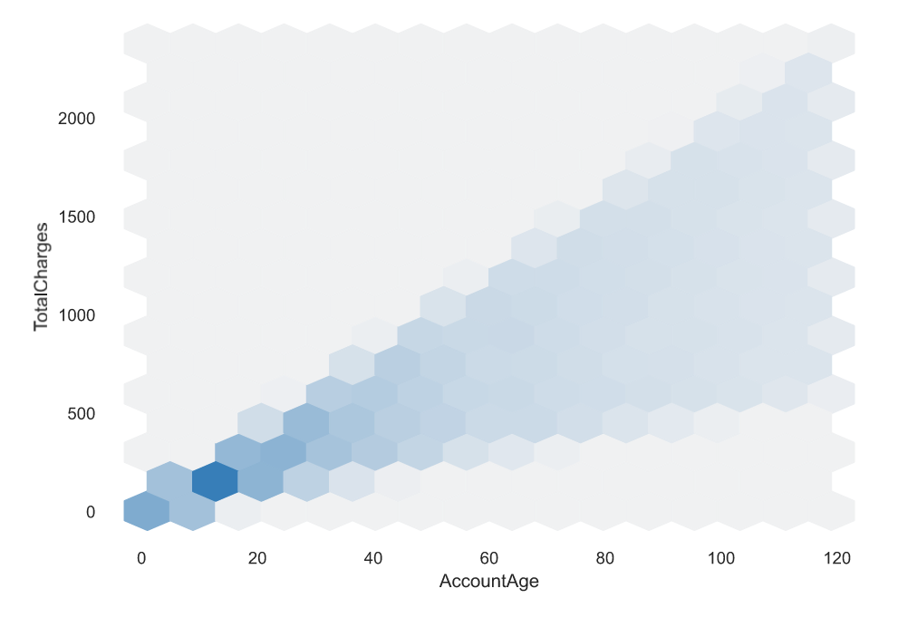
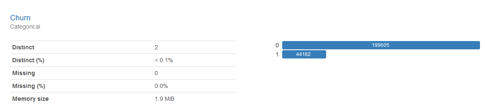
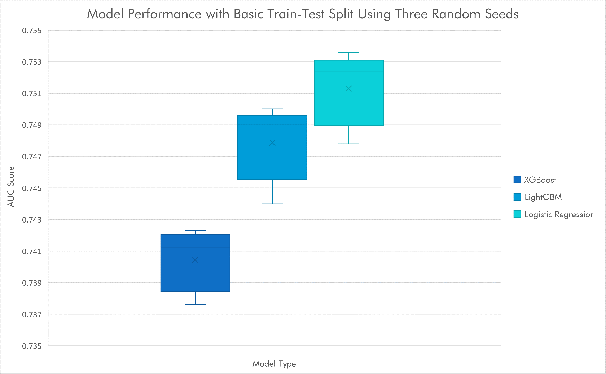
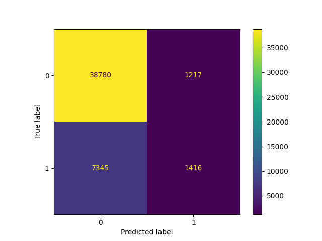

This project was a competition put on by Coursera. It was a quick competition with only three days open for submissions. I achieved a result in the top 1% of all competitors.
<p align="center">

</p>

Each section of this description has an expandable section that goes into more technical detail. 

## Challenge Description

The goal of this challenge was to predict the probability of customer churn for a streaming service. The performance metric for this challenge was the Area Under the Curve (AUC) of the Receiver-Operating Characteristic (ROC). I suppose you could call this a binary classification problem as a customer will either churn or not, but in reality we are looking to predict the probability that a specific customer will churn, making it arguably a regression. A train and test dataset were provided, with the training dataset containing labels for customer churn. The data description is shown in the table below.
<p align="center">

</p>

## General Approach
My general approach to data science competitions or small and well-defined projects is:
1. Exploratory Data Analysis (EDA)
2. Data Preparation
3. Validation Strategy
4. Baseline Model Performance
5. Model Selection
6. Feature Engineering
7. Model Tuning

Larger and more difficult projects result in a more complex flowchart with time spent gathering and documenting requirements, defining the verification and validation strategy, design reviews, and project management. 

## Exploratory Data Analysis

The dataset for this competition was relatively straightforward. There were no missing values in either the training or test dataset. There were no significant outliers, unusual distributions, or heavily skewed features. The only really noteworthy thing I discovered during EDA was that the dataset was imbalanced, only about 18% of the data representing customers that churned.

<details>
    <summary>Expand here for more nerd detail</summary>

>I like to use ydata profiling, a Python package that can generate a pretty nice html report with one line of code. The report is a nice starting point and gives a nice summary of each feature that includes some great information such as:
>* Number of missing values
>* Number of unique values
>* Number of zeroes
>* Max, min, and mean
>* Histogram
>* Extreme values
>* Correlation matrix
>* Variable interactions

>There are 10 categorical features, 9 numeric features, a Customer ID, and a binary target (the target present only in the training dataset).  
>Two features were significantly correlated. This turned out to be pretty intuitive, the Account Age correlating highly with Total Charges with a Spearman Correlation Coefficient of 0.86. 

<p align="center">

</p>

>The above plot comes from ydata profiling and is part of an interactive dashboard that allows you to visualize feature interactions. Pretty nice! You can see a positive linear relationship between these two variables. It may or may not make sense to remove one of these correlated features - we can find out later during feature engineering and model optimization. 
>One last note from the analysis - take a look at the distribution of the label, Churn:

<p align="center">

</p>

>Of the training dataset only about 18% of the customers churn. This is an imbalanced dataset. In an ideal world we would have just as many samples where the customer churns as not - a ratio of 50% - so that we could train our models to classify more accurately. There are far worse imbalances in the world - think of a rare disease that affects 1/100,000 patients - but we do not have an equal number of classes in our sample. 
    
</details>

## Data Preparation

Based on my EDA findings, I encoded categorical data using a really nice one-hot encoding library and normalized numeric columns for the model types that would benefit. 

<details>
<summary>Expand here for more nerd detail</summary>

>My plan was to evaluate baseline performance using four different models: Deep Neural Network (DNN), XGBoost, LightGBM, and Logistic Regression. These are tools that I have used for other competitions with straightforward tabular datasets. A neural network is based on a number of nodes. Each node takes input values, either from the original feature set or from other nodes, and applies a mathematical operation to generate an output. By tuning the coefficients of these mathematical operations one can define complex interactions between features. XGBoost and LightGBM are both boosted, tree-based models. These two models work in slightly different ways and one may offer a performance benefit for a given problem. Logistic regression uses a linear combination of all the features to predict the probability of a classification. I am discussing these models here because each model has different needs for data preparation. 

>### Categorical Features
>While LightGBM and XGBoost have experimental support for categorical features, my preference is to take responsibility for encoding. Both Logistic Regression and the DNN require some kind of encoding for categorical features so it is something I will be doing anyway. 

>For the categorical features in this dataset I chose the one-hot encoding technique. There were some features that you could argue are ordinal (such as Subscription Type - standard, basic and premium), but since one of my models is Logistic Regression there is some danger to ordinal encoding. If I encoded Subscription Type using ordinal encoding and assigned a value of 1 for Basic, 2 for Standard, and 3 for Premium then by nature the contribution of this feature will be stuck with those ratios. Whatever effect Subscription Type contributes through Logistic Regression will be twice for Standard and three times for Premium. By one-hot encoding the model is free to independently determine the contributions of each Subscription Type to the classification.

>I like to use Pandas DataFrames to hold and manipulate datasets. The Pandas library is really fantastic and contains many helpful methods for data manipulation and even visualization. Unfortunately for one-hot encoding I feel the standard Pandas technique has a serious shortfall. The Pandas libarary has a get_dummies method that one-hot encodes a column. It can retain the original column name as a prefix and append the categorical value to the column name. This would result in column names like "SubscriptionType_Basic" and "SubscriptionType_Standard." The shortfall is that this method is not persistent. This means that the get_dummies method on your training DataFrame can return a different number of columns than on your test DataFrame if any of the categorical values are not present in one of the two datasets. The sklearn library has a very nice one-hot encoder but unfortunately does not preserve DataFrame column names by default. While it's not terribly hard to work around all of this, I found a [nice class](https://github.com/gdiepen/PythonScripts/blob/master/dataframe_onehotencoder.py) provided by Guido Diepen under the MIT license (thank you, Guido!) that overcomes this issue. You can create an encoder object that you can use to fit and transform your training DataFrame and then transform your test DataFrame. No column mismatch and you get nice and clear column names by default.

```python
# define categorical columns for one-hot encoding
catcols = ['SubscriptionType', 'PaymentMethod', 'PaperlessBilling', 'ContentType', 'MultiDeviceAccess',
    'DeviceRegistered', 'GenrePreference', 'Gender', 'ParentalControl', 'SubtitlesEnabled']

# create an encoder
df_ohe = DataFrameOneHotEncoder()

# create the encoded feature columns
dummies = df_ohe.fit_transform(train_df[catcols])

# match the index to the original DataFrame
dummies.index = train_df.index

# add the encoded columns to the original DataFrame and drop the originals
train_df = pd.concat([train_df, dummies], axis=1)
train_df = train_df.drop(columns = catcols)

# encode the test DataFrame and drop the original columns
test_df = pd.concat([test_df, df_ohe.transform(test_df[catcols])], axis=1)
test_df = test_df.drop(columns = catcols)
```

>Presto! Encoded DataFrames with clear column names, without having to join the test and train DataFrames or do a lot of work to preserve column names.

>### Numeric Features
>For this challenge, preparation of the numeric features depends on the models used to perform the classification. Two of the models I chose to use in this challenge, XGBoost and LightGBM, are decision tree-based models. As part of the algorithm the model can choose to make a split decision based on a threshold value for a numeric feature. The threshold value is adjusted to minimize entropy. Because of this nature of the algorithm, decision tree-based models do not usually benefit from normalization.

>Both the DNN and Logistic Regression models use the product of coefficients and features to predict the classification. If one feature ranges from -10,000 to +50,000 the coefficient will be dramatically different than a feature that ranges from 0.0001 to 0.0003. To help the model converge faster and avoid potential local minima in the loss function, we normalize the numeric features so that they have a consistent range, typically 0 to 1 or -1 to 1. 

>I used the MinMaxScaler from the sklearn toolkit and normalized all numeric columns to a range from 0 to 1. 

</details>

## Validation Strategy

Have you ever made a change to your model and found a great improvement after testing only to find your leaderboard score actually gets worse? This is a big issue in a lot of competitions and is usually the result of overfitting. If you really want to be able to judge whether a change to your model leads to a true, generalizable improvement, getting a good cross-validation strategy is the key. 

For this competition I ended up using a repeated stratified K-fold with 5 splits and 3 repeats. 

<details>
    <summary>Expand here for more nerd detail</summary>

>The simplest validation strategy is to set aside some percentage of your dataset for testing. This method can work well, but in some cases data critical to training your model to classify properly might be split off into the test dataset. This is especially true in imbalanced datasets. Remember up in our EDA we saw that only 18% of our customers churn? If we set aside 20% of our dataset there is a small chance that all of our examples of churn could be set aside for validation and our model would have no chance of learning how to predict churn. 

>Here is a typical test-train split operation using test_train_split from the sklearn toolkit:
```python
X_train, X_test, y_train, y_test = train_test_split(train_df, y, test_size=0.2, random_state=42)
```
>That's pretty simple and easy. If you want to know if you need a better strategy, run your model and score your result using different random_state values in the line of code above. If you see large swings in your results you probably need to improve your validation strategy.

>Here is a box and whisker plot where I have evaluated model performance using five different random seeds in the test-train split code above:
<p align="center">

</p>

>We might be OK using this simple validation strategy, but let's look at picking between our three models here. While any one of our random seeds would show us that the XGBoost model is the worst performer, there are some runs where our LightGBM model could appear to be superior to our Logistic Regression. After five different random seeds, which would you pick? Looking at this plot the Logistic Regression is the obvious choice but you might have picked wrong just using this basic train-test split method and only one random seed. 

>I opted to use a repeated stratified K-fold from the sklearn toolkit with 5 splits and 3 repeats. The splits refer to the number of folds, or equal parts, that your data gets cut up into. Our dataset has 243,787 rows so each of our folds will be 48,757 or so (rounding error). By using stratified folds the algorithm ensures that each fold contains roughly the same percentage of churn vs no churn customers. This process of stratifying and splitting the dataset into five parts is repeated three times over using a different random seed each time. We evaluate our model and score it on every fold and every repeat and can get an average and standard deviation of our model performance. This gives us a real opportunity to evaluate changes to our model to see if they will generalize well or are potentially overfitting. 

</details>

## Baseline Model Performance

I like to start with a very simple model. This helps me to understand where I am starting from and I can use it to evaluate more sophisticated models to see if the added complexity offers any benefit. There are a lot of simple models you can use as a baseline; I chose the Gaussian Naive Bayes model in the sklearn toolkit. My score with the Gaussian Naive Bayes model was:
>AUC-ROC: 0.737 Accuracy: 0.824

Now I have a starting point I can use to see how a model compares against this very simple baseline.

<details>
    <summary>Expand here for more nerd detail</summary>

>Take a look at the accuracy score - just above 82%. Remember the imbalance of our dataset? Just about 18% of the data points are for customers that churn. If we assumed that every customer would not churn we would be at just about 82% accuracy. Our Gaussian Naive Bayes classifier is maybe marginally better than that. Not great performance there, and maybe an indication that it will be tough to get dramatic improvements. This is also a good example of when accuracy is not a very good metric for imbalanced datasets. 
>For curiosity's sake, let's take a look at the confusion matrix for the Gaussian Naive Bayes model predictions on the test data set.

<p align="center">

</p>

>The confusion matrix is helpful in telling us a bit more of the story. We're obviously not getting great performance out of the model, but we are seeing some ability to predict customers that churn. This model manages a True Positive Rate (TPR) of about 16%. Unfortunately we are also seeing some False Positives and False Negatives. 

</details>

## Feature Engineering

After evaluating a number of options, the only technique with any payoff turns out to be random undersampling to address the imbalance of the dataset. I used the RandomUnderSampler module in the imblearn library to randomly undersample the dataset until the churn positive samples totaled 50% of the total samples. 

<details>
    <summary>Expand here for more nerd detail</summary>

>One thing that I really enjoy in data science is using domain knowledge to synthesize new features from existing features for a performance boost in my model. Sadly, I could not find a single synthesized feature that offered any performance benefit whatsoever. I tried applying some intuition in combining features, such as multiplying the *MonthlyCharges* times the *SupportTicketsPerMonth* and then dividing by *TotalCharges*. My thought process there was that customers that were paying more for the service and reporting more issues through support tickets were more likely to cancel their subscription. I divided by *TotalCharges* thinking that customers who had been with the service longer were less likely to churn.

>Since the dataset is relatively small here I even tried some brute force feature synthesis. This is where you create new features from an algorithmic combination of existing features and evaluate each one in your model(s) to see if there is a performance benefit. Your validation method can come through for you in this exercise. If you don't have a good validation method you can end up thinking you got a performance benefit where in reality there is none there, and vice versa. Don't make the mistake of evaluating synthesized features by simply plugging them in your model and seeing if the feature ranks high in the importance score. This is a rookie move - I know because I've made that very mistake. If your model isn't performing better with a synthesized feature then it doesn't matter what the importance of that feature was in your model. 


</details>
